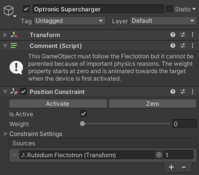
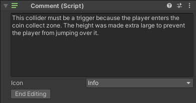

**Comment Component**

Add this component to a GameObject to display a readonly text and 
an icon for documentation purposes or similar.

Double click or press CTRL + Enter/Return to edit the text and select an icon.

Comments within scenes are removed during the build process and will not add overhead to the player.
There's a preferences option to toggle the logging of removed comments.

**Compatibility**

The minimum supported Unity version is 2020.1. The package was tested with the following Unity versions:
 - 2020.1
 - 2020.3
 - 2021.3
 - 2022.1
 - 2023.1 alpha
 
 The package includes tests that can run if the Unity Test Framework package is installed (optional).

**Limitations**

Comments are not removed from prefabs which are not referenced in a scene (e.g. in the Resources folder).
